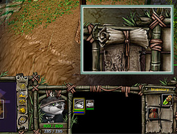
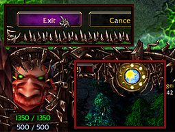
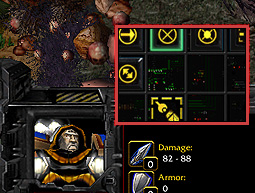
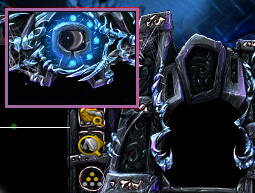
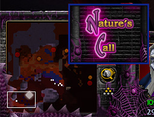
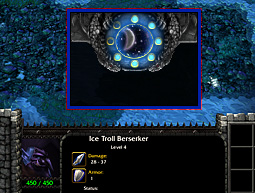
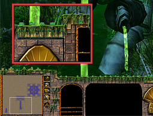
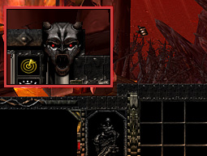

# W3 Util

A small Windows tray utility that makes playing **Dota 1 on RGC (Ranked Gaming Client)** comfortable: sign for games with a hotkey without leaving your current match, get borderless Warcraft III with auto-focus, restyle the game and the client — all from the system tray.

> **Why this exists** 🍻 — I made this for me and my friends, so when we get together for Dota 1 LAN nights like in the good old days, nobody wastes half the evening hunting down patches, fixes and settings scattered across the internet. Everything we use for RGC and Dota 1 lives here — one installer and you're in the game. :D

**[⬇ Download the latest installer](https://github.com/wekz/w3-util/releases/latest)** — one exe, one double-click, everything set up.

## Features

### ⚡ SIGN hotkey — sign without alt-tabbing
Press a hotkey (default `` Alt+` ``, configurable in Settings) and W3 Util clicks the SIGN button **in the background**: the RGC window is never focused, your mouse never moves, and you never leave the game you're playing. It even tells the sign-in and sign-out apart by reading the button state and plays a different chime for each, so you always know what happened without looking.

- One-time setup: hover the SIGN button and press `Alt+F2` to calibrate.
- Works while Warcraft III is fullscreen over the RGC window.

### 🖥 Borderless Warcraft III
When a game starts, the WC3 window is converted to borderless fullscreen and focused automatically — no window frame, no missed lobby. (Requires `-window` in RGC's WC3 launch options.)

### 🔔 Game alerts
Sound + Windows notification the moment your game launches, so you can tab away while waiting for signs.

### 🎨 In-game UI skins
8 alternative in-game interfaces (console, inventory, cursor, tooltips), applied from the tray menu for all four races — so they work in DotA too:

| | | | |
|:-:|:-:|:-:|:-:|
|  |  |  |  |
| Panda | Demon | Industrial | Nerub |
|  |  |  |  |
| RotD | Battle.net | Orc Bonus 1 | Orc Bonus 2 |

### 🏔 Main menu backgrounds
Swap the Warcraft III main menu scene for any ROC/TFT campaign background from the tray menu.

### 🔧 Warcraft III fixes
- **4GB memory patch** — fixes the `SFile.cpp` "not enough memory" crash
- **Latency fix** — lower in-game delay on RGC/LAN (TcpAckFrequency)
- **Smooth graphics** — DPI override + fullscreen optimization fix
- **Mod cleanup** — removes files that break RGC game starts

### 📊 RGC ladder stats
Your rank, W/L, KDA and score from ladder.rankedgaming.com in a small popup, with player search.

### 🎛 Extras
"Wekzy Dark" RGC client skin, custom UI sounds, and the JetBrains Mono font — all bundled in the installer.

## Install

1. Download `W3UtilSetup.exe` from [Releases](https://github.com/wekz/w3-util/releases/latest) and run it (admin prompt — needed because RGC runs elevated).
   - SmartScreen may warn since the exe is unsigned: *More info → Run anyway*.
2. In RGC, add `-window` to the WC3 launch options and (optionally) select the *Wekzy Dark* skin in Preferences.
3. Hover the SIGN button in RGC and press `Alt+F2` once to calibrate.

That's it. W3 Util lives in the system tray and starts with Windows.

## Build from source

No SDK needed — it compiles with the C# compiler that ships with .NET Framework on every Windows:

```powershell
.\build.ps1          # compiles W3Util.exe
.\install.ps1        # run as Administrator - (re)registers the autostart task
.\build-setup.ps1    # optional - packages the all-in-one installer
```

Everything lives in two source files: [`src/RGCWatcher.cs`](src/RGCWatcher.cs) (the app) and [`src/W3UtilSetup.cs`](src/W3UtilSetup.cs) (the installer).

## Notes

- `settings.ini`, `sign-offset.txt`, `sign-states.txt` and logs are machine-specific and not tracked.
- Menu backgrounds and UI skins are Warcraft III game assets (extracted from a legally owned copy) — for personal use with the game you own.
